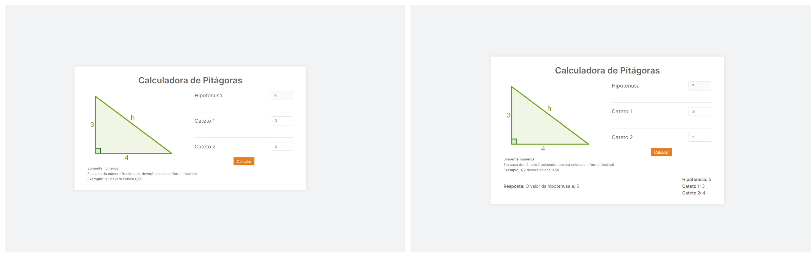
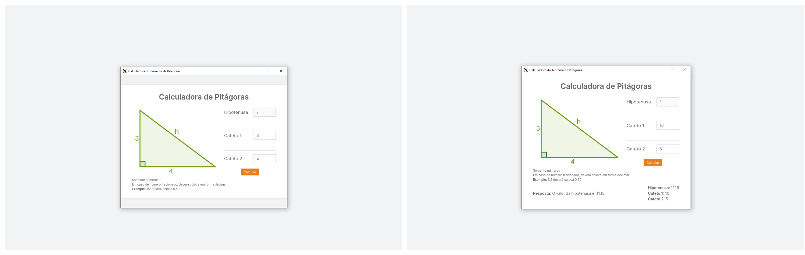

<h1 align="center">
  <strong>Calculadora de Pitagoras</strong> <br />
  <p></p>
  <a href="https://www.linkedin.com/in/italo-alves-48b9b897">
    
  </a>
  <a href="https://github.com/Italo-Alves/pythagorean-calculator/blob/master/LICENSE.md">
    
  </a>
</h1>

<p align="center">
  <a href="#-descrição">Descrição</a>&nbsp;&nbsp;&nbsp;|&nbsp;&nbsp;&nbsp;
  <a href="#-tecnologias">Tecnologias</a>&nbsp;&nbsp;&nbsp;|&nbsp;&nbsp;&nbsp;
  <a href="#-funcionalidades">Funcionalidades</a>&nbsp;&nbsp;&nbsp;|&nbsp;&nbsp;&nbsp;
  <a href="#octocat-instalação">Instalação</a>&nbsp;&nbsp;&nbsp;|&nbsp;&nbsp;&nbsp;
  <a href="#-licença">Licença</a>
</p>

<br />

<p align="center">
<h3 align="center">Versão Web</h3>
  
</p>

<p align="center">
<h3 align="center">Versão Desktop</h3>
  
</p>

## 📄 Descrição

Calculadora de Pitagoras é um app tanto para Web quanto para Desktop, esse app faz cálculo do teorema de pitágoras utilizando uma API em Python.

## 🚀 Tecnologias

Esse projeto foi desenvolvido com as seguintes tecnologias:

- [React](https://pt-br.reactjs.org/)
- [Electron](https://www.electronjs.org/)
- [Typescript](https://www.typescriptlang.org/)

## 📋 Funcionalidades

- [x] Calcula a hipotenusa informando os valores dos dois catetos.
- [x] Resultado da hipotenusa é buscada em uma API Python

## :octocat: Instalação

### Pré-requisitos

Antes de começar, você vai precisar ter instalado em sua máquina as seguintes ferramentas:
[Git](https://git-scm.com), [Node.js](https://nodejs.org/en/), Além disto é bom ter um editor para trabalhar com o código como [VSCode](https://code.visualstudio.com/)

```bash
# Clone este repositório.
$ git clone https://github.com/Italo-Alves/pythagorean-calculator.git

#Vá para a pasta
$ cd pythagorean-calculator

# Instale as dependências com Yarn
$ yarn | yarn install

# Instale as dependências com npm
$ npm install | npm i

# Execute aplicação apenas na Web
$ yarn start | npm run start

# Execute aplicação na Web e no Desktop
$ yarn dev | npm run dev

# O app vai está rodando na porta 3000 - acesse <http://localhost:3000>
```

## 📝 Licença

Esse projeto está sob a licença MIT. Veja o arquivo [LICENSE](LICENSE.md) para mais detalhes.

---

Feito com ♥ by Italo Alves :wave:
